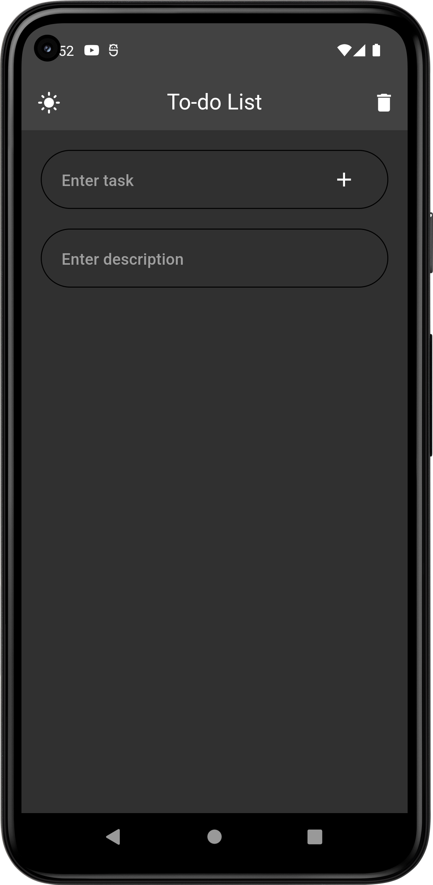
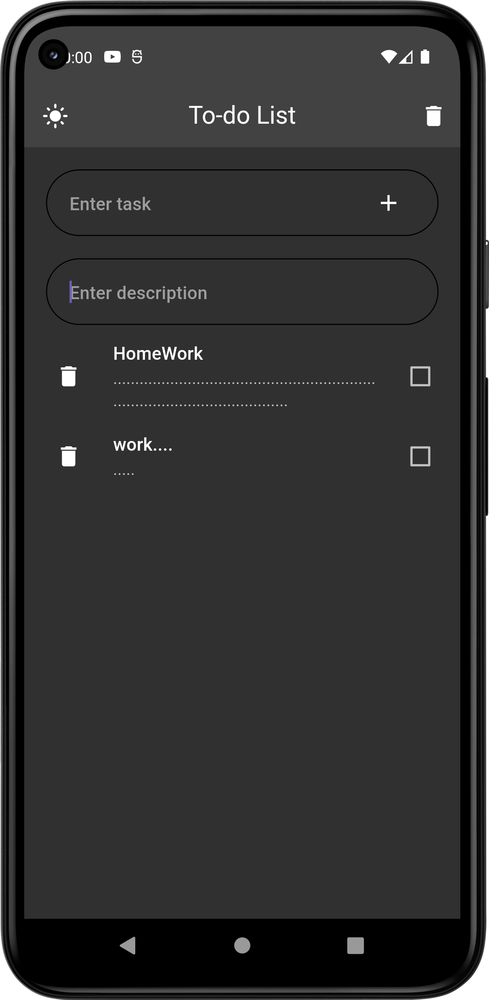

# to_do_app_flutter

  

# 🪪 [License]()
copyright ©[Nirmal Madhani](https://github.com/nirmalmadhani2002). 

### Made with  IN INDIA.

----
### You can show some respct by starring ⭐ the ropository!
----

